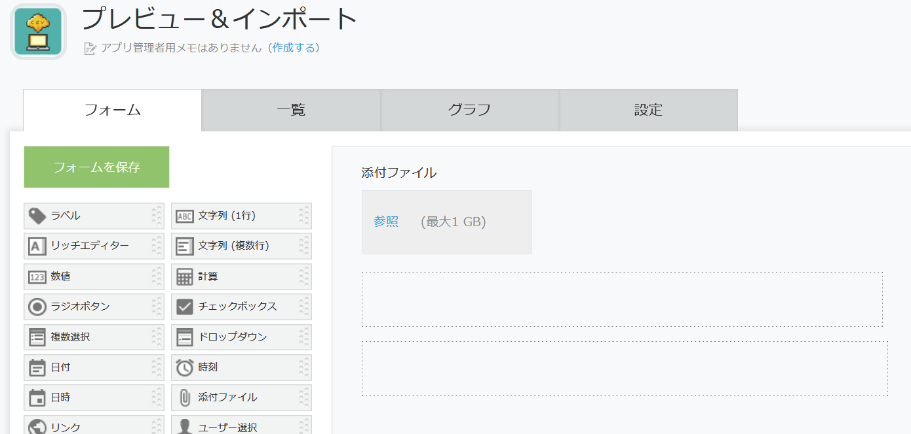
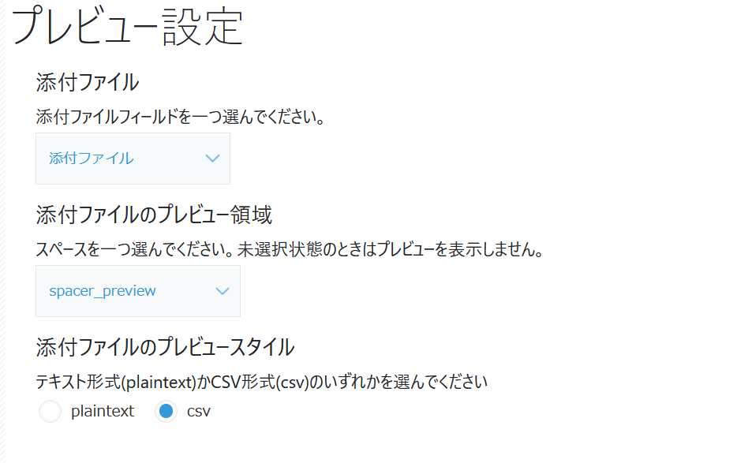
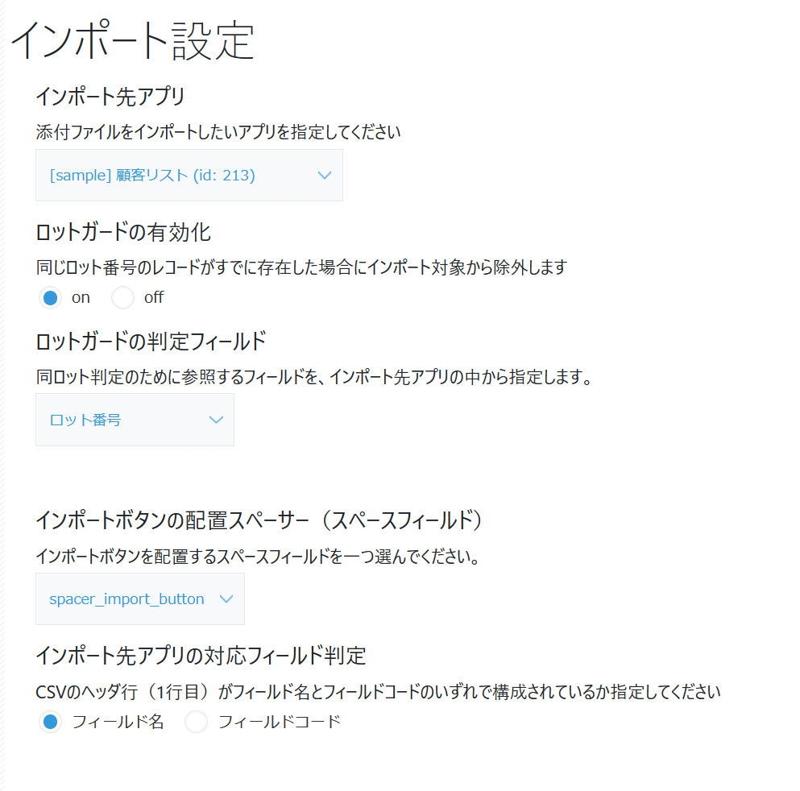
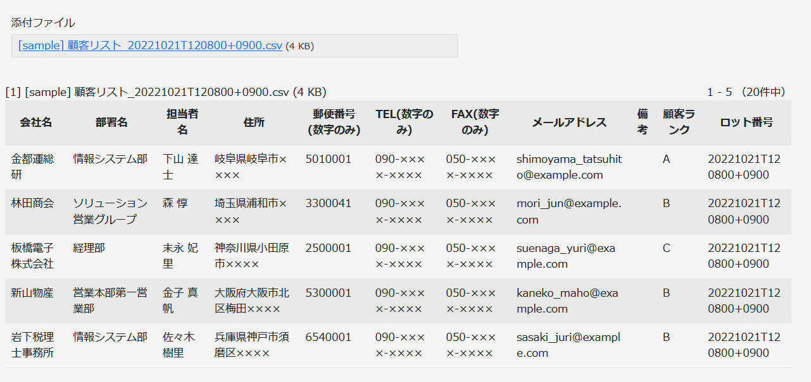
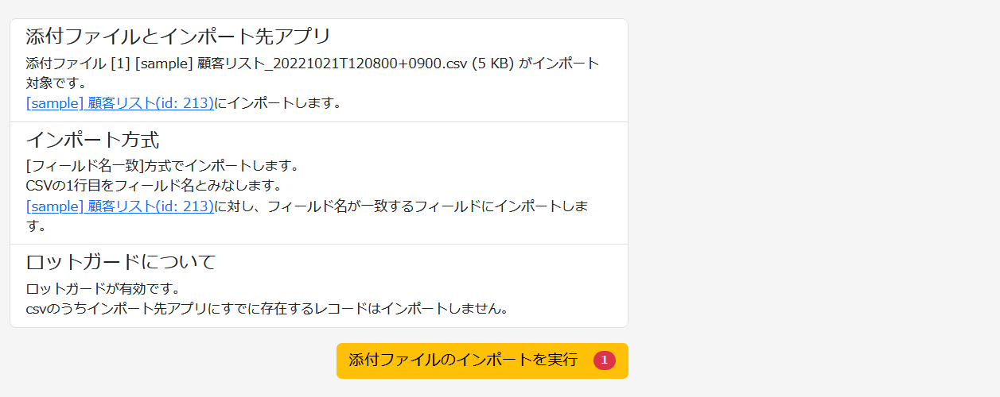
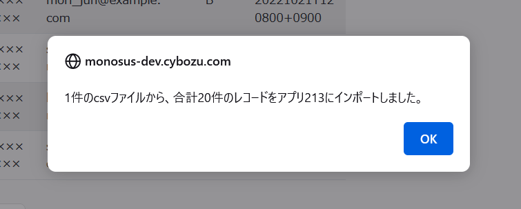
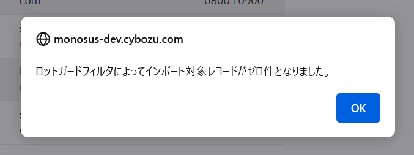

# プレビュー＆インポートプラグイン

添付ファイル(csv)のプレビューと別アプリへのインポート機能を持たせるkintoneプラグインです。添付ファイルのプレビューと、指定したアプリへのインポート機能をkintoneアプリに追加することができます。

## プレビュー機能とインポート機能

### プレビュー機能
指定した添付ファイルフィールドにアップロードしたcsvファイルをプレビューします。

[プレビューの画像]

### インポート機能
設定画面で指定したアプリに対して、csvファイルのインポートを実行します。csvの１行目に格納されているカラムがフィールド名なのかフィールドコードなのか設定画面で指定できます。

[インポート機能の画像]

- `添付ファイルとインポート先アプリ` - 指定した添付ファイルフィールドにあるファイルを列挙します。加えて、インポート先アプリへのリンクもあります。
- `インポート方式` - csvの１行目をフィールド名とするか、フィールドコードと判定するかを設定してください。インポート先アプリの対応するフィールドにインポートします。
- `ロットガード` - 重複登録を回避する仕組みです。判定フィールドの値がインポート先アプリに既に存在する場合、そのレコードを登録しません。

## インストール

お使いのkintone環境にプラグインとしてインストールしてください。

プラグインのzipファイルは、[distディレクトリ](https://github.com/motohasystem/preview-and-import-plugin/tree/main/dist)から入手できます。

## プラグイン設定の3ステップ

### Step-1. 必須フィールドを備えたアプリを用意

動作に必要なフィールドは以下の３つです。

- 添付ファイルフィールド
- スペースフィールド（プレビュー用）
- スペースフィールド（インポート機能表示用）

スペースフィールドの横幅はそのままプレビューの横幅になります。
カラム数が多いcsvを扱うときはあらかじめスペースの横幅を広げておきましょう。

### Step-2. プラグインを設定

プレビューの設定とインポートの設定に大きく分かれます。

- `添付ファイル` - プレビューしたい添付ファイルフィールドをプルダウンから選んでください。
- `添付ファイルのプレビュー領域` - プレビューを表示させたいスペースフィールドをプルダウンから選んでください。
- `添付ファイルのプレビュースタイル` - プレーンテキストで表示するか、csvとしてテーブル表示するかラジオボタンから選んでください。文字コードは[encodings.js](https://github.com/polygonplanet/encoding.js/blob/master/README_ja.md)を使った自動判別です。

- `インポート先アプリ` - インポート先アプリをプルダウンから選んでください。
- `ロットガードの有効化` - 後述のロットガード機能を利用する場合はonを選んでください。
- `ロットガードの判定フィールド` - インポート先に指定したアプリのテキスト一覧フィールドから選んでください。

- `インポートボタンの配置スペーサー（スペースフィールド）` - インポート機能の設定状況や、インポート実行ボタンを表示するスペーサーを選んでください。
- `インポート先アプリの対応フィールド判定` - CSVのヘッダ行（1行目）をフィールド名とするか、フィールドコードとするか、ラジオボタンから選んでください。

### Step-3. プレビューの確認とインポートの実行

指定したスペースフィールドにプレビューします。

インポート機能の表示は、対象の添付ファイル名一覧、インポート先アプリへのリンク、その他の設定項目について確認表示を含みます。

インポートに成功すると下記のダイアログを表示します。

インポートの実行後も添付ファイルは残るため、繰り返しのインポート実行が可能となっています。二重インポートを避けたい場合は、ロットガード機能をご利用ください。

## ロットガード機能について

同じファイルを複数回インポートしてしまわないための対策として、csvのカラムをロット番号（文字列フィールド）として扱うことができます。

csvをソフトウェアで生成している場合は、日付や日時、あるいはUUIDなどがロット番号として使いやすいかと思います。

レコード単位で判定しているため、ひとつのcsvファイルに複数のロットを同居させることができます。その場合は既存のロット番号のみ取り除きます。

## このプラグインで使用しているOSS

下記のライブラリを使用しています。

- `encodings.js` - https://github.com/polygonplanet/encoding.js/blob/master/README_ja.md
- `51-modern-default.css` -  https://github.com/kintone-samples/plugin-samples/blob/master/stylesheet/51-modern-default.css

## License

プレビュー＆インポートプラグインはMITライセンスの元で公開しています。
This plugin is licensed under MIT license.

Copyright (c) 2022 Daisuke Motohashi
https://opensource.org/licenses/MIT

## 機能追加のご依頼をお待ちしています

このプラグインは株式会社モノサスのkintan Lab.事業の一環として公開しています。機能追加やカスタマイズのご要望はお問い合わせフォーム(https://www.monosus.co.jp/contact/)までお願いします。

たとえば...

- Excelファイルにも対応してほしい
- 添付ファイルフィールドを複数セット置きたい
- インポートできる形式に自動で整形してほしい

などご要望をいただければそれに合わせたカスタマイズを提供いたします。
